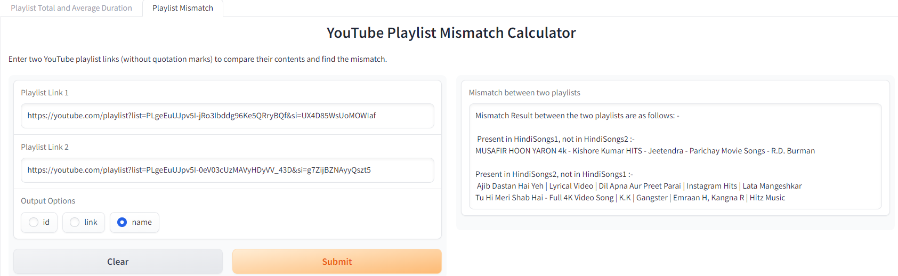

# Total duration of playlist
For a given playlist, it calculates the duration of each public video in that playlist and sums them to produce the total duration. The total duration of the playlist given below is 1 hour, 58 minutes.
[Playlist link](https://youtube.com/playlist?list=PLuhqtP7jdD8CD6rOWy20INGM44kULvrHu&si=G4rrT1wQfQVvzTJF)

  

# Average duration of a playlist
Average duration of videos is calculated for the publicly available videos in that playlist. For example, the average duration of videos in this playlist is around 9 minutes.

  

# Playlist mismatch
Given two playlists, this function gets the videos that are present in one of the playlists, but not in the other. 
The two playlists are given here, [HindiSongs1](https://youtube.com/playlist?list=PLgeEuUJpv5I-jRo3Ibddg96Ke5QRryBQf&si=HZKtxDOm6RbmYieu) and [HindiSongs2](https://youtube.com/playlist?list=PLgeEuUJpv5I-0eV03cUzMAVyHDyVV_43D&si=t8mf-O0CNe23dwlS).

  

**************************************************************************************************
Check out the configuration reference at https://huggingface.co/docs/hub/spaces-config-reference
